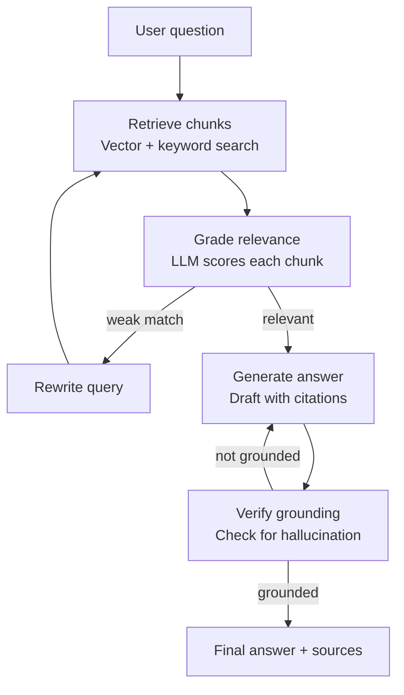

# Building an Agentic RAG Knowledge Assistant

A complete guide: theory, architecture, tech stack, and build plan.

---

## 1. What is RAG?

**RAG (Retrieval-Augmented Generation)** solves a core limitation of LLMs: a model only knows what was in its training data. RAG gives it a "lookup step" before answering.

The basic pipeline ("naive RAG"):

1. Take your documents (PDFs, notes, wiki pages, etc.)
2. Split them into small chunks
3. Convert each chunk into a **vector embedding** (a list of numbers representing meaning)
4. Store these vectors in a **vector database**
5. When a user asks a question, embed the question too, and find the chunks whose vectors are closest (most semantically similar)
6. Feed those chunks into the LLM's prompt as context, and ask it to answer **using only that context**

Naive RAG works, but it's fragile: bad retrieval leads to a bad answer, and the model has no way to notice when it retrieved garbage or when its own answer drifted from the sources.

---

## 2. Why "Agentic" RAG is different

Naive RAG is a straight pipeline: retrieve → generate. It has no ability to notice its own mistakes.

**Agentic RAG** wraps that pipeline in a loop where the LLM acts like a researcher, not just a responder:

- **Query planning** — break a complex question into sub-questions before retrieving
- **Self-grading retrieval** — after retrieving chunks, the LLM judges whether they're actually relevant to the question
- **Corrective retrieval** — if the retrieved docs are weak, rewrite the query and search again (or fall back to a web search)
- **Self-critique of the answer** — after drafting an answer, check whether every claim is actually supported by the retrieved sources
- **Iteration** — if the check fails, loop back and fix it, rather than shipping a bad answer
- **Grounded citations** — the final answer explicitly ties each claim back to a source chunk

This retrieve → grade → generate → check → correct pattern is known in the research literature as **Corrective RAG (CRAG)** or **Self-RAG**, and it's the core idea behind this project.

---

## 3. Key concepts to understand

| Concept | What it means |
|---|---|
| Chunking | Splitting documents into pieces (e.g. 500–1000 tokens) small enough to embed meaningfully, usually with slight overlap between chunks |
| Embeddings | Numeric vector representations of text meaning, generated by an embedding model |
| Vector similarity search | Finding chunks whose embeddings are closest to the query's embedding (cosine similarity) |
| Hybrid search | Combining vector search with classic keyword search (BM25) — vector search alone can miss exact terms, names, or codes |
| Reranking | A second, more precise model re-scores the top retrieved chunks to push the best ones to the top |
| Grounding / hallucination check | Verifying every sentence in the final answer is actually backed by retrieved text |
| Agent loop / ReAct | The LLM alternates between reasoning and acting (e.g. calling a search tool), observing results, and deciding the next step |

---

## 4. System architecture



**Flow explanation:**

1. **User question** enters the system.
2. **Retrieve chunks** — the system searches the vector store (and optionally keyword index) for the top-k most relevant chunks.
3. **Grade relevance** — an LLM call checks each retrieved chunk and discards the ones that aren't actually useful for the question.
4. If nothing relevant survives grading, the system **rewrites the query** (e.g. rephrases it, breaks it into sub-questions) and retrieves again. This loop is capped at a small number of retries to avoid infinite loops.
5. Once relevant context exists, the system **generates an answer**, instructed to cite sources inline and to say "not enough information" rather than guess.
6. **Verify grounding** — a separate LLM call checks whether every claim in the drafted answer is actually supported by the retrieved context.
7. If the answer isn't grounded, the system loops back to regenerate (or re-retrieve for a fuller pass).
8. Once grounded, the system returns the **final answer with sources** (filename + page/section for each citation).

---

## 5. Tech stack and APIs needed

You need three core pieces, minimum:

| Need | Options | Cost notes |
|---|---|---|
| LLM (reasoning, grading, generation) | Anthropic Claude API, OpenAI API, or a local model via Ollama (Llama 3, Mistral) | Claude/OpenAI: pay-per-token, a few dollars total for a portfolio project. Ollama: free but needs decent local compute |
| Embeddings | OpenAI `text-embedding-3-small`, Cohere embed, or a local `sentence-transformers` model (e.g. `bge-small-en`) | Local sentence-transformers = $0, runs fine on CPU |
| Vector database | Chroma (free, local, zero setup), Qdrant (free self-hosted or cloud), Pinecone (managed, free tier), FAISS (library, not a full DB) | Chroma is the easiest starting point |

**Recommended combination for a portfolio project:**
- **Claude API** for the LLM — reasoning quality matters a lot for the grading and self-check steps
- **sentence-transformers** for free local embeddings
- **Chroma** for the vector store

This combination costs almost nothing beyond LLM API calls, and each piece can be swapped out independently later — worth mentioning as a design choice (provider-agnostic architecture) in an interview.

### Framework choice

| Framework | Strengths | Weaknesses |
|---|---|---|
| LangChain | Most popular, huge ecosystem | Can feel like a black box; sometimes seen as "just glue code" |
| LlamaIndex | RAG-specific, strong retrieval abstractions | Less suited to building custom agent loops |
| LangGraph | Built for graphs/loops of steps — cycles, conditional branches, retries | Slightly more setup than a simple chain |
| No framework (raw Python) | Most impressive for a portfolio — proves you understand the internals | More manual work |

**Recommendation:** Use **LangGraph** for the agent loop (a real orchestration framework recruiters recognize), but write the retrieval, grading, and verification logic yourself rather than relying on prebuilt chains. This proves you understand what's happening under the hood.

---

## 6. Project structure

```
agentic-rag/
├── data/                    # your source documents
├── ingest.py                # load, chunk, embed, store
├── vectorstore.py           # vector store wrapper
├── nodes/
│   ├── retrieve.py          # retrieval node
│   ├── grade.py             # relevance grading node
│   ├── generate.py          # answer generation node
│   ├── verify.py            # hallucination/grounding check node
│   └── rewrite.py           # query rewriting node
├── graph.py                 # state machine wiring all nodes together
├── app.py                   # CLI or simple UI entrypoint
└── requirements.txt
```

---

## 7. Build plan, step by step

**Step 1 — Ingestion**
Load source documents, split them into overlapping chunks, embed each chunk, and store the vectors alongside metadata (filename, page number). Preserving metadata at this stage is what makes source citation possible later — don't skip it.

**Step 2 — Define agent state**
Set up a shared state object that flows through every step of the pipeline: the original question, the retrieved documents, the current draft answer, a grounded/not-grounded flag, and a retry counter (to cap loops).

**Step 3 — Retrieval node**
Given the question, search the vector store for the top-k most similar chunks and attach their source metadata.

**Step 4 — Grading node (the first "agentic" step)**
For each retrieved chunk, ask the LLM a focused yes/no question: is this chunk actually relevant to answering the question? Discard anything that isn't.

**Step 5 — Generation node**
Draft an answer using only the surviving context, with an explicit instruction to cite the source (filename + page) for every claim, and to say plainly when there isn't enough information rather than guessing.

**Step 6 — Verification node (the second "agentic" step)**
Ask the LLM to check the drafted answer against the retrieved context: is every factual claim actually supported? This is the hallucination check.

**Step 7 — Wire the loops**
- If grading finds no relevant documents (and retries remain), route to a query-rewriting step, then back to retrieval.
- If verification finds the answer isn't grounded (and retries remain), route back to generation (or further back to retrieval for a fuller redo).
- Otherwise, return the final answer with sources.

**Step 8 — Run and test**
Feed in real questions against your document set and inspect both the final answers and the intermediate state (which chunks were kept/discarded, how many retries occurred) to sanity-check the system's behavior.

---

## 8. What makes this portfolio-worthy (not just a toy project)

- The **grading node** proves you understand that retrieval quality isn't guaranteed.
- The **verification/grounding node** proves you understand hallucination is a real, first-class failure mode — not an afterthought.
- The **conditional loops** prove you can build cyclic, stateful systems, not just a linear chain.
- **Cited sources with page numbers** prove you handled metadata correctly through the entire pipeline.
- Adding an **evaluation step** (e.g. using a framework like RAGAS to measure faithfulness and answer relevance against a test set of Q&A pairs) is what separates "I built a demo" from "I built a system I can measure." This is worth adding once the core loop works.

---

## 9. Possible next steps

- Add hybrid search (vector + BM25 keyword search) for better recall on exact terms and names
- Add a reranking step after retrieval, before grading
- Add a simple front end (CLI, Streamlit, or a small web UI) so the assistant is demoable
- Add an evaluation script with a fixed test set of questions and expected answers, tracked over time as you tune the system