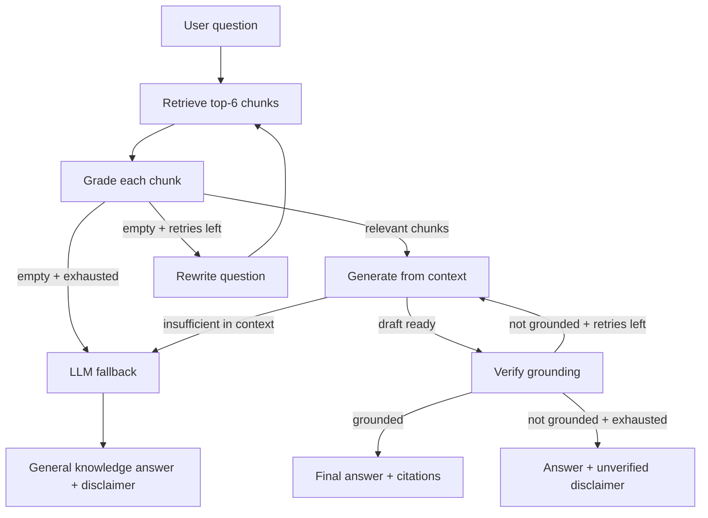

# Agentic RAG Knowledge Assistant

An agentic retrieval-augmented generation (RAG) system that answers questions over your own documents with grading, grounding checks, query rewriting, and an LLM fallback when the corpus does not contain the answer.

Built with **LangGraph**, **Supabase (pgvector)**, **sentence-transformers**, and **NVIDIA NIM**.

---

## What it does

Unlike naive RAG (retrieve → generate), this pipeline acts like a researcher:

1. **Retrieve** — embed the question and fetch the top similar chunks from Supabase
2. **Grade** — LLM yes/no relevance check on each chunk; discard noise
3. **Rewrite** — if nothing survives grading, rephrase the question and search again (up to 3 retries)
4. **Generate** — draft an answer using only graded context, with inline citations `[file.pdf, p.N]`
5. **Verify** — LLM checks whether every claim is supported by the sources
6. **Fallback** — if documents cannot answer, use general LLM knowledge (clearly labeled)

### Answer outcomes

| Status | Meaning |
|--------|---------|
| `success` | Answered from your documents, grounding verified |
| `unverified` | From documents, but verification failed after retries (includes disclaimer) |
| `llm_fallback` | Documents did not contain the answer; general LLM knowledge used (includes disclaimer) |

---

## Architecture



---

## Tech stack

| Component | Choice |
|-----------|--------|
| Orchestration | [LangGraph](https://langchain-ai.github.io/langgraph/) |
| LLM | NVIDIA NIM (`meta/llama-3.1-8b-instruct` via OpenAI-compatible API) |
| Embeddings | `BAAI/bge-small-en-v1.5` (384-dim, local via sentence-transformers) |
| Vector DB | Supabase Postgres + [pgvector](https://github.com/pgvector/pgvector) |
| Document parsing | `pypdf` (PDF), plain text for `.txt` / `.md` |
| CLI | `app.py` |

---

## Project structure

```
agentic-rag/
├── data/                    # Source documents (gitignored; add locally)
│   └── .gitkeep
├── nodes/
│   ├── retrieve.py          # Vector search via Supabase match_documents
│   ├── grade.py             # Per-chunk relevance grading
│   ├── rewrite.py           # Query rewriting on failed retrieval
│   ├── generate.py          # Context-grounded answer generation
│   ├── verify.py            # Hallucination / grounding check
│   └── fallback.py          # General LLM answer when docs fall short
├── sql/
│   ├── document_chunks.sql  # Table + match_documents function (384-dim)
│   └── fix_embedding_dimension.sql
├── ingest.py                # Chunk, embed, insert into Supabase
├── state.py                 # AgentState TypedDict
├── llm.py                   # NVIDIA NIM client (retries on 429)
├── graph.py                 # LangGraph wiring + run_query()
├── app.py                   # Interactive CLI
├── requirements.txt
├── .env.example
└── .gitignore
```

---

## Setup

### 1. Clone and create a virtual environment

```powershell
cd agentic-rag
python -m venv .venv
.\.venv\Scripts\Activate.ps1
pip install -r requirements.txt
```

Always run commands with the venv active (`(.venv)` in your prompt), or use `.\.venv\Scripts\python.exe` directly.

### 2. Configure environment

```powershell
copy .env.example .env
```

Edit `.env`:

```env
NVIDIA_API_KEY=your_nvidia_api_key_here
NVIDIA_MODEL=meta/llama-3.1-8b-instruct
SUPABASE_URL=your_supabase_project_url_here
SUPABASE_SERVICE_ROLE_KEY=your_supabase_service_role_key_here
```

Get an NVIDIA API key from [build.nvidia.com](https://build.nvidia.com). Use **`meta/llama-3.1-8b-instruct`** on the free tier — larger models (e.g. 70B) are very slow or time out.

### 3. Set up Supabase

In the **Supabase SQL Editor**, run the full contents of:

```
sql/document_chunks.sql
```

This creates:

- `document_chunks` table (`embedding vector(384)`)
- HNSW index for cosine search
- `match_documents(query_embedding, match_count)` RPC function

If you previously created the table with `vector(1024)`, run `sql/fix_embedding_dimension.sql` instead.

### 4. Add documents and ingest

Place `.pdf`, `.txt`, or `.md` files in `data/`, then:

```powershell
python ingest.py
```

Ingestion:

- Chunks text at ~512 tokens (model max) with ~15% overlap
- Preserves `source_file`, `page_number`, and `chunk_index`
- Embeds with `bge-small-en-v1.5` (normalized)
- Inserts rows into Supabase

Documents in `data/` are **gitignored** — each developer adds their own files locally.

### 5. Run the assistant

```powershell
python app.py
```

Ask questions interactively. Type `quit` or `exit` to leave.

---

## Adding more documents

There is no Supabase-only shortcut for ingesting PDFs — chunking and embedding require Python.

```powershell
# 1. Copy new file(s) into data/
# 2. Run ingest
python ingest.py
# 3. Use app.py immediately (no restart needed)
```

**Note:** `ingest.py` processes **every file in `data/`** and **appends** rows. It does not overwrite the table. Re-running on files already ingested creates **duplicate chunks**.

To re-ingest a single updated file:

```sql
DELETE FROM document_chunks WHERE source_file = 'your-file.pdf';
```

Then run `python ingest.py` (ideally with only that file in `data/`, or accept re-processing all files).

---

## Agent state

Shared state flows through every LangGraph node (`state.py`):

| Field | Purpose |
|-------|---------|
| `question` | User query (may be rewritten across retries) |
| `retrieved_chunks` | Raw vector search results |
| `graded_chunks` | Chunks that passed relevance grading |
| `draft_answer` | Current LLM answer attempt |
| `is_grounded` | Whether verification passed |
| `retry_count` / `max_retries` | Loop guard (default max 3) |
| `final_answer` / `status` | Terminal output |

Programmatic usage:

```python
from graph import run_query

result = run_query("What is the OPT STEM extension policy?")
print(result["answer"])
print(result["status"])  # success | unverified | llm_fallback
```

---

## Operational notes

- **Rate limits:** NVIDIA free tier returns `429` if you send too many requests quickly (grading uses 6 calls per retrieval cycle). The client retries with backoff; wait ~60s between heavy sessions if needed.
- **Embeddings:** Query embeddings use the BGE retrieval prefix; document chunks are embedded without a prefix (standard asymmetric setup).
- **Chunk grading:** One LLM call per retrieved chunk, with a short delay between calls to reduce burst traffic.
- **HF Hub warning:** Optional — set `HF_TOKEN` in your environment for faster model downloads on first run.

---

## Possible next steps

- `python ingest.py --file mydoc.pdf` — ingest a single file without duplicating others
- Hybrid search (vector + BM25) for exact terms and acronyms
- Reranking before the grade step
- Streamlit or web UI
- Evaluation script (e.g. RAGAS) with a fixed Q&A test set

---

## License

Educational project.
